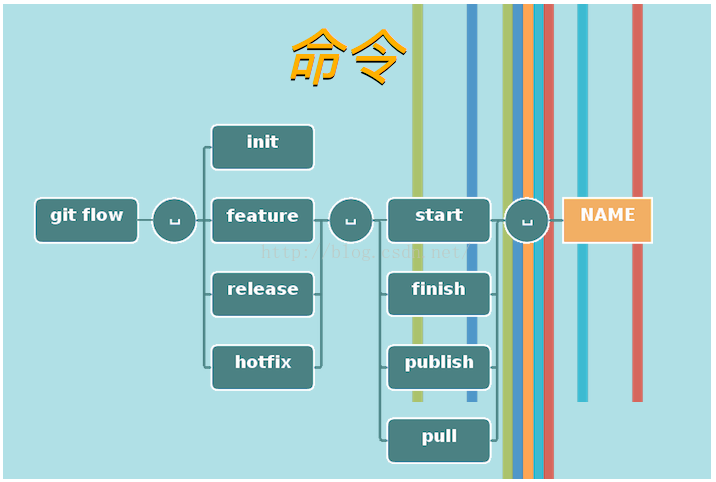
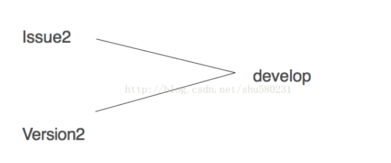

### Git Flow使用方法

git flow是一个git的扩展集。Git flow 可以工作在 OSX, Linux 和 Windows之下。
本文主要列举一些常用的git flow命令。以及git flow从无到有的步骤；

1. 安装。

2. 初始化。git flow init       最后就一路回车选择默认的就ok了，，接下来就是使用了

**常用命令以及分支**：

分支介绍：

1. master。只有一个，并且不会在master上进行代码的操作。

2. develop。只有一个，新特性的开发是基于develop开发的，但是不能直接在develop上进行开发，而是在基于develop上创建feature分支进行新特性的开发。

3. feature。可以同时存在多个，基于develop分支被创建。对于每一个新的功能可以创建一个新的feature分支，开发结束之后，合并到develop分支即可。

   创建一个新的feature分支，命令：git flow feature start name 执行之后，feature/name分支就会被创建。

   当新特性开发完成过后，需要合并到develop上，命令:git flow feature finish name  执行之后，feature/name分支的内容就会合并到develop，，并且删除feature/name分支。

4. release分支。release分支是为了发布而存在的分支，基于develop分支被创建。在同一时间只能有一个release分支，在此分支上仅仅是较少代码的修复。否则，容易引起release分支不稳定。当release分支被创建之后，develop分支可能在准备另一个版本的，因此，当release分支merge回develop分支时候可能会出现冲突，需要手工解决冲突。

   创建一个release分支，命令：git flow release start v.1.0

   当完成release分支功能之后，执行命令：git flow release finish v.1.0。这个命令会执行一下的操作：

   （1.分支merge回master分支；2.使用release分支名称打tag；3.release分支merge回develop分支；4.删除release分支。）

5. hotfix分支。当发现master分支出现一个需要紧急修复的bug，这个时候就需要使用hotfix。基于master分支被创建。同一时间只有一个hotfix分支，生命周期比较短。

创建hotfix分支。命令：git flow hotfix start v.1.0

结束hotfix分支。命令：git flow hotfix finish v.1.0。会把hotfix分支merge到master和develop分支，并且删除此分支。（⚠️注意，如果bug修复时，存在release分支，那么hotfix会merge到release分支，不是develop了。）

通过下图大致了解一下基本命令：

以下这些是我在使用过程中遇到的一些解决方法：

issue2以及version2都是feature分支，同时间在开发，但是功能并为结束，仅仅进入测试阶段，最后都需要合并到develop上，（这里不合适，不应该在develop上进行开发测试）这个时候，我们可以直接切到develop上，进行　git merge feature/issue2 这里也是可以的，但是最保险并且分支图美观的做法就是现在issue2分支上fetch和rebase，，

命令：`git fetch`              ` git rebase develop issue2`.  

- 直接把目前develop上最新的代码合并到issue2 上，如果有冲突的话可以可以直接在issue2上进行修改，不会影响到develop分支。